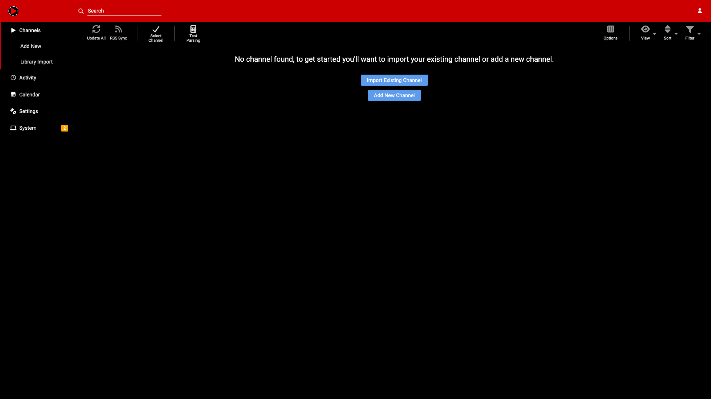
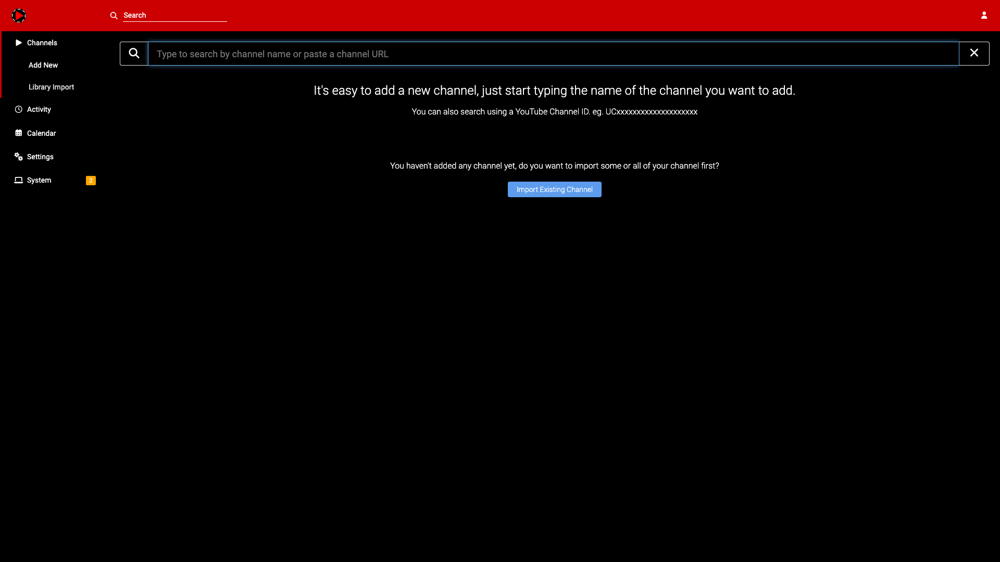
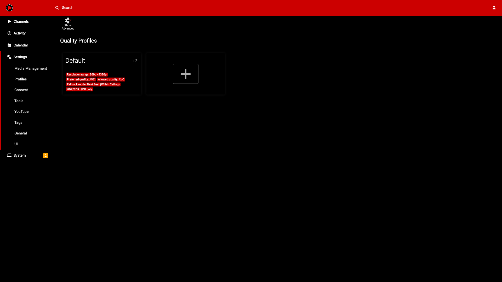
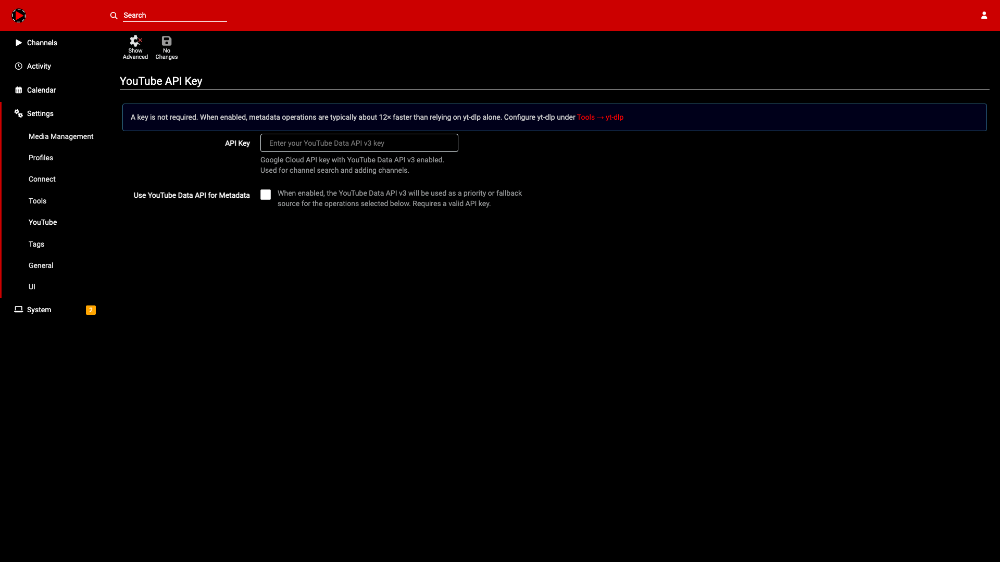
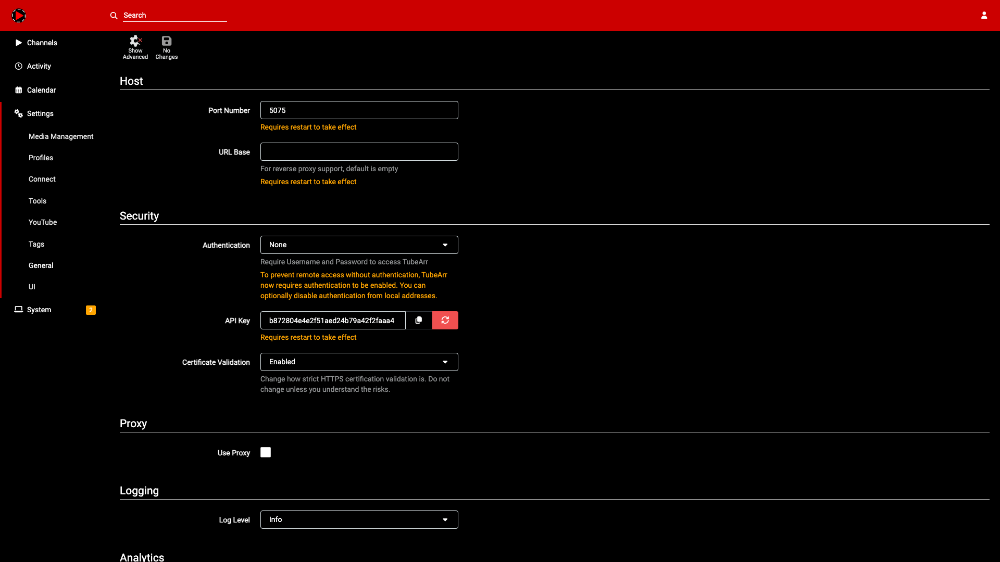
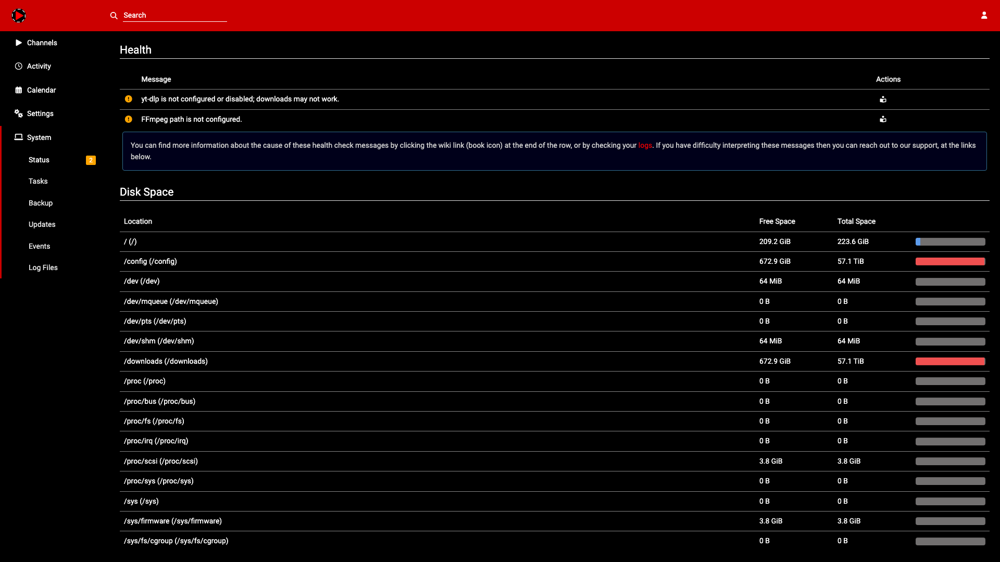

# TubeArr

TubeArr is a self-hosted YouTube channel manager in the style of Sonarr/Radarr. Add channels, set monitoring rules, queue downloads via **yt-dlp**, and organize your library with proper metadata for Plex, Jellyfin, and Kodi.



## Features

- **Channel monitoring** — track entire channels, specific playlists, or a rolling window of the latest N videos
- **Playlists as seasons** — map YouTube playlists to Plex/Jellyfin seasons for a native TV library experience
- **Quality profiles** — friendly UI for yt-dlp format selection (resolution, codec, container, HDR/SDR)
- **NFO metadata** — generates `tvshow.nfo`, `season.nfo`, and episode metadata with artwork export
- **Plex metadata provider** — built-in provider so Plex understands your YouTube library natively
- **Smart filters** — filter out Shorts, livestreams, or use custom rules to create "smart seasons"
- **Download management** — parallel workers, automatic retry with backoff, partial resume

| Add Channel | Quality Profiles | YouTube Settings |
|:-----------:|:----------------:|:----------------:|
|  |  |  |

| Settings | System Status |
|:--------:|:-------------:|
|  |  |

## Quick Start (Docker)

```yaml
services:
  tubearr:
    image: ghcr.io/tubearrteam/tubearr:latest
    container_name: tubearr
    restart: unless-stopped
    ports:
      - "5075:5075"
    volumes:
      - ./config:/config
      - /path/to/youtube:/downloads    # <-- change this
    environment:
      - TZ=America/New_York
      - ConnectionStrings__TubeArr=Data Source=/config/TubeArr.db
```

```bash
docker compose up -d
```

Open **http://localhost:5075** and configure:

1. **Settings → Tools** — yt-dlp path is `/usr/local/bin/yt-dlp` (pre-installed in the image)
2. **Settings → Media Management** — set your root folder to `/downloads`
3. **Settings → YouTube** — optionally add a YouTube Data API key for faster metadata lookups
4. **Add a channel** and start downloading

The SQLite database and all config persist in `./config/`.

Also available on Docker Hub: `docker pull smashingtags/tubearr:latest`

### Build from source

```bash
git clone https://github.com/tubearrteam/TubeArr.git
cd TubeArr
docker compose up -d --build
```

## Requirements (bare metal)

- **.NET 8 SDK** (backend)
- **Node.js 24** (or newer) and **npm** (frontend build and dev tooling)
- **yt-dlp** (downloads; configure the full path in the app)
- **ffmpeg** (used by yt-dlp for muxing/post-processing)

## Installation (bare metal)

```bash
npm install
npm run build:frontend
dotnet run --project backend/TubeArr.Backend.csproj --urls http://localhost:5075
```

### Development (hot reload)

Two terminals:

```bash
# Backend (API on port 5075)
npm run dev:backend

# Frontend (webpack dev server on port 3000, proxies to backend)
npm run dev:frontend
```

## Configuration

### `appsettings.json`

| Setting | Purpose |
|---------|---------|
| `ConnectionStrings:TubeArr` | SQLite connection string |
| `YouTube:ApiKey` | Optional bootstrap API key (also configurable in the UI) |
| `TubeArr:DownloadHistoryRetentionDays` | How long to retain download history (default 90) |

Override with environment variables using the ASP.NET Core `__` convention (e.g., `ConnectionStrings__TubeArr`).

### Web UI settings

- **YouTube** — Data API key, API priority list for operations
- **Tools / yt-dlp** — executable path, cookies file, parallel workers
- **Media Management** — root folders, naming rules
- **Profiles** — quality profiles for yt-dlp format selection

## Monitoring

- **Whole channel** — download everything
- **By playlist** — monitor specific playlists as seasons
- **Rolling window** — keep the latest N videos monitored
- **Filter Shorts** — skip YouTube Shorts
- **Filter livestreams** — skip live/archived content
- **Custom playlists** — rule-based "smart seasons" (title contains X, etc.)

## Tests

```bash
npm test
```
